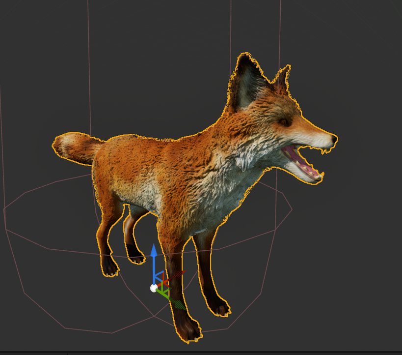

# Prototype Ideas

## Game ideas

Puzzle platformer relying on AI behaviour and interaction within the world. With different pickupable items being able to affect the world and the creatures within. Some levels may ask the player to use the creatures habits to make a path forward, like removing the food so they eat at the unwalkable area full of bushes. Or the player could use fire from a torch item to scare/guide them away from the objective.

- cite and talk about monster hunter world

## Engine

UE5 
(reason)

## Language

C++
(reason)

## Possible mechanics to focus on
- AI implementation through both docile and aggressive creatures
    - The creatures themselves can have AI pathways that influence what it does
    - Interacting with the environment through its behaviours
    - Switching between a searching phase, a resting phase and an eating phase
    - Phases get cycled through from resting -> searching -> eating and so forth
- Inventory system to store and use items
    - Keys used to open doors
    - Grass that can placed in front of the player
    - Torches that can create fire on certain tiles/anywhere
    - 
- Different movement types to enable world traversal
    - Climbing
    - Jumps (possibly more than one)
- Attacks as a form of interaction
- Movable blocks within the world
- Character dialogue as in universe explanations
- Carrying mechanic
    - Larger items
    - Possibly the creatures within reason

## Level Plan

The overal plan for the prototype is to get from point A (at the bottom of a hill) to point B(at the top of the hill). This can be accomplished through puzzle solving with the different mechanics at play.  
There will be a fur coated animal which covers one to four tiles total, with it having options between different patches of tall grass to eat at, with gaps between resting.  
While this creature is resting, the player can then harvest the remaining growing crops to then place in a pit, for the animal to fall and creaete a path to the exit.

Later in development a new level had to be made for the prototype as the default didn't work correctly with the navigation mesh. An empty map was made with simple platforms to provide the same function as the plans.

- mention and cite captain toad 

## Research

This section will cover the research made for the features present within the prototype. Primarily it will cover my findings on ai pathways and how I can implement it into the game.

As behaviour trees are something I have little information on, I gathered research on how to implement them within the project as the main mechanic. I started by experimenting with the basic nodes and seeing how it interacts with the animal, then recieved helpful insight from my peers and lecturer on more advanced features. Using the Unreal Engine documentation page on behaviour trees was useful as a base to set everything up well for the implementation within the project. 

The video below was used partway through the project to fill in the gaps of knowledge where things were not going well.

<iframe width="560" height="315" src="https://www.youtube.com/embed/QJuaB2V79mU?si=VSsZL8-AGoeETXgN" title="YouTube video player" frameborder="0" allow="accelerometer; autoplay; clipboard-write; encrypted-media; gyroscope; picture-in-picture; web-share" referrerpolicy="strict-origin-when-cross-origin" allowfullscreen></iframe>    

Other forms of research came in looking up certain nodes within blueprints, as I know how to implement most of the mechanics it just misses that one important node/element that makes it work efficiently. Relying on Unreal Engine documentation and AI hints allowed me to find what I miss.

As I am slightly unfamiliar with animation sequences I experimented with animation blueprints to bring the sequences together, however I am currently unsure of the reasoning behind what to do.////
Expand upon this^^

## Workings

### Animal Class

To start with the ai I used a character blueprint class, with an ai controller attatched to it. I wanted to start this within blueprints so I can lay the groundwork before using c++ since this is the first proper time using ai within UE5. After the character was created and placed into the level, a navigation mesh was placed down across the entire stage along with basic blueprints for the character to move to random points on the level.
Within the animal's AI Controller, it sets up the Behaviour Tree alongside some of the variables that are contained within the blackboard component. Such as the Grass block location and if its valid or not, all set up with the event tick. The AI controller doesn't hold much more information as most of the animal's behaviours come from the behaviour tree custom tasks.

> BP Input Here

* A free animal asset pack labelled "AnimalVarietyPack" was added into the project
  * Allows me to temporarily make the animal look like an animal
  * This came with the downsides of having the animations be animation sequences, alongside having to work out how to implement them into the states.
  * As a result, the behaviour tree can be expanded upon to give the ai the actions it needs to function within the ideas of the game.

### Behaviour Tree

I am slowly understanding how behaviour tree tasks work, I tried to follow the Unreal Engine documentation on it and after a few attempts I stripped it all to start again with a basic move to task. This behaviour tree can be split into two different halfs, the idle activity and the active tasks. These tasks are set up so that the fox animal is constantly in a active state, dependant of a blackboard float "energy" alongside multiple other booleans.

* Idle
  * Resting
    * Causes the animal to play a short sequence of animations indicating sleep
    * The energy variable increases by a set amount
  * Roaming
    * Causes the animal to move to a random location in the nav mesh
    * Decreases the energy variable by a set amount
      
* Active
  * CanReach
    * A revision of a previous task
    * Detects if the block is both valid and if it is reachable to the animal
  * PitRedo
    * A second version of a task
    * Places the animal into the pit when the grass block is placed in
    * If the grass is not in the pit it continues the gameplay loop
  * MoveTo
    * A simple move to which only works if the prior tasks return successful

* A behaviour tree was implemented with a blackboard planned to give the animal ai different actions/states
  * Basic tasks named "Idle", "Searching", and "Eating" have been made
  * More tasks have been added to expand what the animal can do

### Grass Actor

This is an actor that will be interacted with by both the player and the animal ai. The player will be able to pick it up (by destroying the actor and storing it as a variable) and place it anywhere within the level (using spawn actor of class) using the "E" key.

The Animal ai will interact with the grass by chasing after it, causing the actor to move to another location when both it and the animal's collision box overlap.

* A simple actor class to be interacted with
  * Slightly translucent to seem more like the desired outcome
  * Aimed to move to a new location when the animal interacts with it
  * Will grow in size after moving to appear like a new patch of tall grass
  * Can be picked up and placed by the player for the main puzzle element
 
## Player Character

There wasn't much changed to the player character, but since they aren't the main focus it was intentional.
The only additions made towards the player was in terms of movement, as the jump mechanic was removed to prevent the player from cheezing the level by jumping to the exit.

## Testing

## Feedback

## Declared Assets
* Chat GPT
  * AI Tool
* AnimalVarietyPack
  * Free asset pack

## Bibliography
Monster hunter world
Captain Toad
https://dev.epicgames.com/documentation/en-us/unreal-engine/behavior-tree-in-unreal-engine---quick-start-guide
(Work on this)

 This works and lays the groundwork which I can develop off of. This is also bringing me up to date with why the previous ones didn't work, as when I switched the 'move to' from a predone vector to the grass object the animal actor refused to move, so my thoughts are to translate the object's location into a readable vector for the behaviour tree. The end goal of this commit is to do this and upload onto the github website.
The level has been arranged to something more similar to the puzzle that's going to be used in the prototype, with a gap in the middle for the animal (when finished) to fall down to provide passage for the player to access the other side. 

* The animal now moves according to the behaviour tree, so it currently moves towards the grass actor.
* Grass actor detects when its collision touches the animal and moves to another spot, creating the food collection cycle
Next steps based on this would be to add more onto the animals tree for a rest cycle and prowling/searching.
Giving the animal more believability would be nice as an extra step, such as turning manually and animations on its movements
Alongside this I would need to add an item pickup to allow the player to pickup the grass to have the animal seek it out after being placed.

The main issue of why the unique tasks made were not working have been found to be because the node used to initiate them was "Event Receive Execute" instead of "Event Receive Excecute AI", this has been fixed so the behaviour trees can be simplified.

The behaviour tree has been edited with branches for:
* Looking at the object
* Moving towards the object and plays animation for eating
* Moving towards the pit as a last resort (a placeholder while the function is being worked out)

Adding a grab system for the item, but theres an issue with the item not spawning with the players at their location.

Overall the recent additions added to the behaviour trees, with there now being a wider range of options connected to the main sequences. The fox animal now has a rotation tool towards a selected area that needs fixing as it doesn't go towards the item smoothly as a rotation. Alongside this there is a constant issue with the new grab feature, where the actor that is being picked up is returned back to where it was destroyed. 

Moving on I need to fix the issues with the grab feature and simplify the foxes behaviour so it becomes easier to read and edit.
The navigation mesh needs to be better implemented so the object doesn't spawn within the walls.
I also could add an inventory system for the picked up item alongside a win condition for when the player reaches the other side.
Once these have been implemented I will be able to create the protoprototype for other users to experiment with.

### Animal searching/Grass location change tests
* Moved twice then grass spawned right next to animal, preventing it from being overlapped again
* Didn't appear to move when overlapped with animal
* Had a perfect change of location up to 5 times before staying in the same spot
* Grass object moved inside a wall.

> Was given advice and shown how to add a function library for the "getrandomlocationinnavigableradius" labelled as the random location function
> Used a "nearly equal" to compare the transformed location and the original, so it can try and recorrect the move.
> I tried adding a secondary smaller collision box for primarily the animal but it only works half the time
* Animal now moves towards it, but the issues of a close move still occurs
> Solution found was to loop the random location finder and setter until the grass block leaves the animals collision.
* Grass block checks for the animal, if its still collided it performs another random move

Next steps are to add gravity and make the grass spawn in front of player rather than inside.
Edit the ai to only go in the pit if the grass is there
Add celebratory text
Extras...
Create playable build.

Currently trying to fix the grass block and its collision, as in order to fall when dropped I made it a physical object. This caused an infinite loop when the animal interacted with it, which I theorise is to be caused by the animal not being able to fully complete the goal of reaching the origin of the grass block. To solve this I fiddled with the collision types in the project editor, adding a "grass" type that can be transferred to other items of similar needs.
>Image of error screen
The only other issues occurring with this now is the cube appearance stays in place while the object moves. I can tell based on how the animal moves towards empty spaces each time the behaviour tree loops, while the block appears to remain in the same location. I tried adding a shpere mesh to see if this would move whilst the others stayed in the same location, which is exactly what happened. When comparing the differences I noticed it could be due to the simulate physics being ticked, which when unticked allowed the box to move but stopped the box from falling.
>Image of new grass hierachy
This has been solved by changing the heirachy to have the mesh become the root node with the collision box attached to that, now when the grass block moves, everything is grabbed with it with an extra detail of it growing out of the ground
>Image of before and after growing
The placement of the block had to be fixed again so its placed at a distance, so a "getforwardvector" was used and added to the players location to get the placement location.

The next step that needs to be implemented before the prototype level is fully playable is to alter the animal behaviour to recognise when the grass block is in the bit and proceed to follow it in. As an extra challenge.

>Current thoughts:
>> Add behaviours for the animal to detect where the object is
>> Resting nature to be added
>> Split ideas of either getting the animal to naturally fall down or a behaviour to only do so when the block is noted to be down there.

 This is a small update for me to alter where the grass spawns, as the grass block needed a bit of extra tweeking to get it to respawn where is fully needed.

The behaviour of roaming was implemented. 
This would get the animal to move to a random location inbetween the food seeking
Using the same getrandomlocationinnavigablearea worked as there wasn't a real need for the animal to go to a specific location, I just wanted to have the animal behave in more manners than just eat.

I also added a second secondary behaviour that can alternate with the walking on a selector branch of the tree, this would be the sleeping behaviour where the animal lays down. This would activate when a new float "energy" depletes past a certain point, being depleted through actions like roaming. decoratiors.......

This created an issue where upon activating the sleep function, instead of moving to the eating immediately, the animal would start the lying animation and then move as part of the roaming, getting stuck in the process.

Found a fix for the "sleep walking". There was an option in the behaviour tree decorators that would automatically fail a branch if the selector value became false midway through. I changed the notify observer in the decorator from "on value change" to "on result change" which resolved this issue. With this change it will only select one selector composite node, even if the energy value changes within.

I also 

###

# What to include in dev log:
* Images
* Videos
* Links to resources

# Extra steps:
* Title, pause and win screen
* User testing
* Polishing
* Unique player character

> Iamge of mesh nav
>
> Talk about the issue with wall
> 
> Implemented a free asset pack named "variety animal pack" to temporarily act as the ai animal
> The animation came as animation sequences so I am having to put them together using state machines

